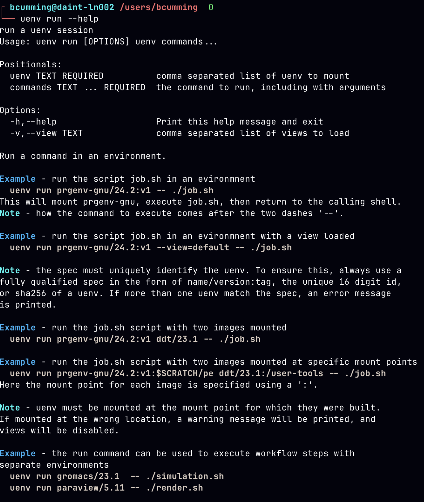

# uenv on Alps
<br>

Ben Cumming

CSCS Webinar 2025

---

# uenv on Alps

On Daint, Santis and Clariden CSCS supports two software environments:
* **uenv**: self-contained application and use-case specific software stacks
* **container engine**: container runtime with SLURM integration

Daint has the CPE installed through the `cray` module
* provided "as is" -- and will be deployed via containers to continue providing up to date installations

Eiger provides:
* CPE and EasyBuild recipes
* uenv
* Sarus for containers

**Eiger will be updated to match Daint in early June**: Pilatus will be available for users to prepare.

---
layout: two-cols
layoutClass: gap-2
---

# uenv documentation

The up-to-date `uenv` documentation is available on the **new CSCS documentation** site:

* [uenv documentation](https://eth-cscs.github.io/cscs-docs/software/uenv/)
* [scientific application uenv](https://eth-cscs.github.io/cscs-docs/software/sciapps/)
* [programming environment uenv](https://eth-cscs.github.io/cscs-docs/software/prgenv/)

The uenv command line provides context-sensitve help using the `--help` flag:
```bash
uenv --help
uenv image --help
uenv image find --help
uenv run --help
```

::right::



---
layout: two-cols
layoutClass: gap-2
---

# Environments are files

Installed software is part of your environment.

Linux/Unix best practice is to use **prefix-based installation**

`make install` of SQLite3 configured with `--prefix=$SQLITE_ROOT` generates the following:
```
$SQLITE_PATH/bin/sqlite3
$SQLITE_PATH/include/sqlite3.h
$SQLITE_PATH/lib/libsqlite3.so
$SQLITE_PATH/lib/libsqlite3.a
$SQLITE_PATH/lib/pkgconfig/sqlite3.pc
```

**modify, add or delete a path, and runtime behavior can change.**

::right::

```
# PATH is a list of two paths
> echo $PATH
/home/bcumming/.local/bin:/usr/bin

# rg is in the first path
> which rg
/home/bcumming/.local/bin/rg

> rg --version
ripgrep 13.0.0 (rev af6b6c543b)
-SIMD -AVX (compiled)
+SIMD +AVX (runtime)

# modify the first path (delete rg)
> rm /home/bcumming/.local/bin/rg

# ... and behavior changes
> which rg
/usr/bin/rg

> rg --version
ripgrep 14.1.1
features:+pcre2
simd(compile):+SSE2,-SSSE3,-AVX2
simd(runtime):+SSE2,+SSSE3,+AVX2
```

---

# Environments are variables

**Environment variables** affect configure, build and runtime behavior

* `PATH`: where to search for executables
* `CFLAGS` & `LDFLAGS`: flags to pass when compiling/linking
* `LD_LIBRARY_PATH`: where to search for libraries at runtime
* `CUDA_HOME` & `CUDA_PATH`: CMAKE, autotools, Python use to find CUDA tools at compile or runtime
* `PKG_CONFIG_PATH` & `CMAKE_PREFIX_PATH` : build tools use to find dependencies

The `module` command uses terminal magic 💫  to set environment variables.

For example `module load cray`:
* sets `MODULEPATH`, `PATH`, `LD_LIBRARY_PATH` and friends
* sets 64 variables containing `CRAY_`

---

# uenv are environments

When a uenv is started it does two things:

1. mount a SquashFS file at `/user-environment` or `/user-tools`
    * a directory tree full of files "appears"
2. set a pre-configured batch of environment variables defined in a _view_.

Everything else about the environment is the same.

uenv are self-contained:
* `prgenv-gnu`: compilers, Python, MPI, [CUDA], fftw, hdf5 etc
* `gromacs`: GROMACS, GROMACS+PlumeD, everything to build your own GROMACS
* `vasp`, `namd`, `lammps`, etc: supported apps and the tools to build your own versions
* `pytorch`: Python, NCCL, Torch, WandDB - a toolkit for PyTorch workflows.

---

# Describing uenv

uenv have a label: `name/version:tag@system%uarch`
* `name`: the name, e.g. `prgenv-gnu`, `pytorch` or `gromacs`
* `version`: version or release date, e.g. `2025.1` or `4.3`.
* `tag`: for handling multiple
* `system`: the cluster, e.g. `daint`, `eiger`, `santis`, etc.
* `uarch`: the node architecture:
    * `gh200`: clariden, daint, santis
    * `zen2`: eiger, bristen
    * `a100`: bristen, balfrin

uenv commands accept full or partial labels. The following are valid in different contexts

`prgenv-gnu/24.11:v1@daint`, `@*`, `:v1`, `namd`, `prgenv-gnu%gh200`

---

# finding and listing uenv

A **registry** is a 

Registry vs. Repository

Find vs. List

---

# getting uenv

`uenv image pull`

`uenv image add`

---

# running uenv

`uenv run`
- views and environment variables

---

# interactive: running in a shell

---

# using srun to run jobs

---

# writing sbatch jobs

- avoid `#SBATCH --uenv` etc
- instead use `uenv run` and `srun --uenv`

---

# Using uenv on different clusters

The `CLUSTER_NAME` variable defines the cluster on Alps.

`uenv` and the SLURM plugin use this variable to filter results.

```bash
$ echo $CLUSTER_NAME
santis
$ uenv image find pytorch --no-header
$ uenv image find pytorch@* --no-header
pytorch/v2.6.0:v1  gh200  clariden  fca6205ff6eec0e0   8,164    2025-04-04
pytorch/v2.6.0:v1  gh200  daint     fca6205ff6eec0e0   8,164    2025-04-04
$ uenv image pull pytorch/v2.6.0:v1@clariden
$ uenv start pytorch/v2.6.0@clariden --view=default
$ python -c "import torch; print(torch.cuda.is_available())"
True
```

**uenv are generally portable on the same node type**
* e.g. `clariden`, `santis`, and `daint` are almost identical at the OS level
* large divergence between cluster configurations might break some uenv in the future


---

# Demo time: build an application

Build two applications using `prgenv-gnu`:

* easy: [CSCS Affinity](https://github.com/bcumming/affinity)
* tricky: [MicroHH 2.0](https://microhh.readthedocs.io/en/latest/index.html)

---

<br>
<br>
<br>
<br>
<br>

## Thank you!

<br>
<br>

## Any questions?

