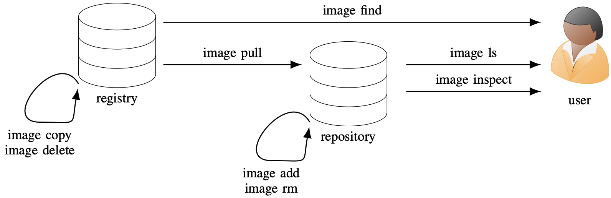
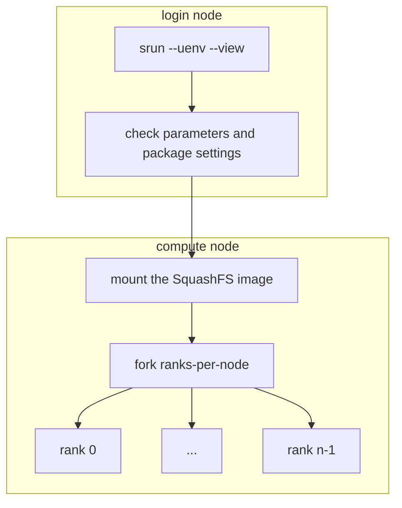

# uenv on Alps
<br>

Ben Cumming

CSCS Webinar 2025

---

# uenv on Alps

On Daint, Santis and Clariden CSCS supports two software environments:
* **uenv**: self-contained application and use-case specific software stacks
* **container engine**: container runtime with SLURM integration

Daint has the CPE installed through the `cray` module
* provided "as is" -- and will be deployed via containers to continue providing up to date installations

Eiger provides:
* CPE and EasyBuild recipes
* uenv
* Sarus for containers

**Eiger will be updated to match Daint in early June**: Pilatus will be available for users to prepare.

---
layout: two-cols
layoutClass: gap-2
---

# uenv documentation

The up-to-date `uenv` documentation is available on the **new CSCS documentation** site:

* [uenv documentation](https://eth-cscs.github.io/cscs-docs/software/uenv/)
* [scientific application uenv](https://eth-cscs.github.io/cscs-docs/software/sciapps/)
* [programming environment uenv](https://eth-cscs.github.io/cscs-docs/software/prgenv/)

The uenv command line provides context-sensitve help using the `--help` flag:
```bash
uenv --help
uenv image --help
uenv image find --help
uenv run --help
```

::right::


---
layout: two-cols
layoutClass: gap-2
---

# Environments are files

Installed software is part of your environment.

Linux/Unix best practice is to use **prefix-based installation**

`make install` of SQLite3 configured with `--prefix=$SQLITE_ROOT` generates the following:
```
$SQLITE_PATH/bin/sqlite3
$SQLITE_PATH/include/sqlite3.h
$SQLITE_PATH/lib/libsqlite3.so
$SQLITE_PATH/lib/libsqlite3.a
$SQLITE_PATH/lib/pkgconfig/sqlite3.pc
```

**modify, add or delete a path, and runtime behavior can change.**

::right::

```
# PATH is a list of two paths
> echo $PATH
/home/bcumming/.local/bin:/usr/bin

# rg is in the first path
> which rg
/home/bcumming/.local/bin/rg

> rg --version
ripgrep 13.0.0 (rev af6b6c543b)
-SIMD -AVX (compiled)
+SIMD +AVX (runtime)

# modify the first path (delete rg)
> rm /home/bcumming/.local/bin/rg

# ... and behavior changes
> which rg
/usr/bin/rg

> rg --version
ripgrep 14.1.1
features:+pcre2
simd(compile):+SSE2,-SSSE3,-AVX2
simd(runtime):+SSE2,+SSSE3,+AVX2
```

---

# Environments are variables

**Environment variables** affect configure, build and runtime behavior

* `PATH`: where to search for executables
* `CFLAGS` & `LDFLAGS`: flags to pass when compiling/linking
* `LD_LIBRARY_PATH`: where to search for libraries at runtime
* `CUDA_HOME` & `CUDA_PATH`: CMAKE, autotools, Python use to find CUDA tools at compile or runtime
* `PKG_CONFIG_PATH` & `CMAKE_PREFIX_PATH` : build tools use to find dependencies

The `module` command uses terminal magic 💫  to set environment variables.

For example `module load cray`:
* sets `MODULEPATH`, `PATH`, `LD_LIBRARY_PATH` and friends
* sets 64 variables containing `CRAY_`

---

# uenv are environments

When a uenv is started it does two things:

1. mount a SquashFS file at `/user-environment` or `/user-tools`
    * a directory tree full of files "appears"
2. set a pre-configured batch of environment variables defined in a _view_.

Everything else about the environment is the same.

uenv are self-contained:
* `prgenv-gnu`: compilers, Python, MPI, [CUDA], fftw, hdf5 etc
* `gromacs`: GROMACS, GROMACS+PlumeD, everything to build your own GROMACS
* `vasp`, `namd`, `lammps`, etc: supported apps and the tools to build your own versions
* `pytorch`: Python, NCCL, Torch, WandDB - a toolkit for PyTorch workflows.

---

# Describing uenv

uenv have a label: `name/version:tag@system%uarch`
* `name`: the name, e.g. `prgenv-gnu`, `pytorch` or `gromacs`
* `version`: version or release date, e.g. `2025.1` or `4.3`.
* `tag`: for handling multiple
* `system`: the cluster, e.g. `daint`, `eiger`, `santis`, etc.
* `uarch`: the node architecture:
    * `gh200`: clariden, daint, santis
    * `zen2`: eiger, bristen
    * `a100`: bristen, balfrin

uenv commands accept full or partial labels. The following are valid in different contexts

`prgenv-gnu/24.11:v1@daint`, `@*`, `:v1`, `namd`, `prgenv-gnu%gh200`

---

# Finding uenv

<div class="flex justify-center">
    
</div>

The **registry** is a server with all of the uenv provided by CSCS.
* `uenv image find` will list available images: e.g. `uenv image find namd@eiger`

A **repository** is a filesystem folder with uenv that have been downloaded:
* `uenv image ls` will list pulled images: e.g. `uenv image ls pytorch`

uenv must be pulled to a repository before you can use them.

---

# Dowloading uenv

Use `ueng image pull` to download a uenv from the registry.

<div class="flex justify-center">
Example: download the latest version of `prgenv-gnu` on Eiger:
</div>

```bash
$ uenv image ls prgenv-gnu
uenv                 arch  system  id                size(MB)  date
prgenv-gnu/24.11:v1  zen2  eiger   0b6ab5fc4907bb38     572    2024-11-27
$ uenv image find prgenv-gnu
uenv                 arch  system  id                size(MB)  date
prgenv-gnu/24.11:v1  zen2  eiger   0b6ab5fc4907bb38     572    2024-11-27
prgenv-gnu/24.11:v2  zen2  eiger   9c9bbe55b6142eab     576    2025-03-31
prgenv-gnu/24.7:v1   zen2  eiger   7f68f4c8099de257     478    2024-07-01
$ uenv image pull prgenv-gnu/24.11:v2
pulling 9c9bbe55b6142eab 100.00% ━━━━━━━━━━━━━━━━━━━━━━━━━━━━━━ 576/576 (0.00 MB/s)
updating prgenv-gnu/24.11:v2@eiger%zen2
$ uenv image ls prgenv-gnu
uenv                 arch  system  id                size(MB)  date
prgenv-gnu/24.11:v1  zen2  eiger   0b6ab5fc4907bb38     572    2024-11-27
prgenv-gnu/24.11:v2  zen2  eiger   9c9bbe55b6142eab     576    2025-03-31
```

> **Note**: the `24.11:v1` version of `prgenv-gnu` is still available to use.

---

# `uenv run`: execute a command in an environment

`uenv run` runs a command with a uenv activated - and returns after it has been run

```
$ which mpicc
which: no mpicc in (/users/bcumming/.local/x86_64/bin:/usr/local/bin:/usr/bin:/bin:/usr/lpp/mmfs/bin:/usr/lib/mit/bin)
$ uenv run --view=default prgenv-gnu/24.11:v2 -- which mpicc
/user-environment/env/default/bin/mpicc
```

This "wraps" the call with the environment:
* later calls are not affected by earlier calls
* compare this to interleaving `module load/swap/unload` between application calls

```bash
# use a text editor provided by a uenv
$ uenv run --view=ed editors -- nvim
# use the python REPL
$ uenv run --view=default prgenv-gnu/24.11:v2 -- python
# use a graphical application
$ uenv run --view=default netcdf-tools/2024 -- ncview sst_nmc_daSilva_anoms.66-03.DJF.nc
```

---

# `uenv start`: use uenv interactively

`uenv start` loads a shell with the environment loaded - the following calls are equivalent:

```
uenv start prgenv-gnu/24.11:v2 --view=default
uenv run   prgenv-gnu/24.11:v2 --view=default bash
```

* `uenv start` will use your default shell, which for 99% of users on Alps is `bash`

Useful for compilation, working in a Python/Julia REPL and exploring uenv -- use `exit` or `<ctrl-d>` to end the session

```bash
# start the session
$ uenv start prgenv-gnu/24.11:v2 --view=default
# do work in the sesssion
$ CC=mpicc CXX=mpic++ cmake ..
# end the session
$ exit
```

**Warning**: `uenv start` will not work in `~/.bashrc` or a SLURM batch job
* `module load` changes the current shell - `uenv start` starts a new shell.

---
layout: two-cols
layoutClass: gap-2
---

# SLURM speaks uenv

On Alps the uenv SLURM plugin configures uenv on the compute nodes of jobs.

When you call `srun` or `sbatch` on the login node with `--uenv` and `--view` flags:
* **login node**: Check the parameters, find the SquashFS image and set environment variables
    * fail early on the login node if there is an error without using resources.
* **compute**: mount the SquashFS image before forking the MPI ranks on the node

The SquashFS image is mounted once per node.

::right::



---

# SLURM integration: srun

Use the `--uenv` and `--view` flags with `srun`... the following are eqivalent:
```
$ srun -n4 -N1 uenv run prgenv-gnu --view=default python3 ./big-job.sh
$ srun -n4 -N1 --uenv prgenv-gnu --view=default python3 ./big-job.sh
```

Using the SLURM plugin is more efficient:
* SquashFS is mounted only once
* It fails immediately without using resources if there is an invalid parameter

SLURM detects and uses the calling uenv environment on compute nodes (just like modules)
```bash
$ uenv start prgenv-gnu/24.11:v2 --view=default
$ srun -n128 -N32 --gpus-per-task=1 python3 ./runner.py
```


---
layout: two-cols
layoutClass: gap-1
---

# Using uenv in sbatch jobs

The `--uenv` and `--view` flags are available sbatch:
```bash
#!/bin/bash
#SBATCH --time=00:10:00
#SBATCH --nodes=1
#SBATCH --ntasks-per-node=1
#SBATCH --uenv=namd/3.0:v3
#SBATCH --view=namd-single-node

# uses the namd uenv
srun namd3 +p 29 +pmeps 5 +setcpuaffinity +devices 0,1,2,3

# override the default uenv
srun --uenv=prgenv-gnu/24.11 --view=default ./post-proc
```

The uenv and view will be loaded inside the script, and inside the `srun` call.

**Fun fact**: the commands in an sbatch script execute on the first compute node in your job.

::right::

**Best Practice**: specify the uenv where it will be used

```bash
#!/bin/bash
#SBATCH --time=00:10:00
#SBATCH --nodes=1
#SBATCH --ntasks-per-node=1

# run a serial pre processing step
uenv run --uenv=prgenv-gnu/24.11 --view=default \
    python3 ./generate-inputs.py

# run the simulation
srun  --uenv=namd/3.0:v3 --view=namd-single-node \
    namd3 +p 29 +pmeps 5 +setcpuaffinity +devices 0,1,2,3

# override the default uenv
srun -n4 -N1 --uenv=paraview --view=paraview \
    ./generate-images
```

**Why?** because the script will run in a "clean" environment, with each call **encapsulated** in its target environment.

---

# Using uenv on different clusters

The `CLUSTER_NAME` variable defines the cluster on Alps.

`uenv` and the SLURM plugin use this variable to filter results.

```bash
$ echo $CLUSTER_NAME
santis
$ uenv image find pytorch --no-header
$ uenv image find pytorch@* --no-header
pytorch/v2.6.0:v1  gh200  clariden  fca6205ff6eec0e0   8,164    2025-04-04
pytorch/v2.6.0:v1  gh200  daint     fca6205ff6eec0e0   8,164    2025-04-04
$ uenv image pull pytorch/v2.6.0:v1@clariden
$ uenv start pytorch/v2.6.0@clariden --view=default
$ python -c "import torch; print(torch.cuda.is_available())"
True
```

**uenv are generally portable on the same node type**
* e.g. `clariden`, `santis`, and `daint` are almost identical at the OS level
* large divergence between cluster configurations might break some uenv in the future


---

# Demo time: build an application

Build two applications using `prgenv-gnu`:

* easy: [CSCS Affinity](https://github.com/bcumming/affinity)
* tricky: [MicroHH 2.0](https://microhh.readthedocs.io/en/latest/index.html)

---

<br>
<br>
<br>
<br>
<br>

## Thank you!

<br>
<br>

## Any questions?

